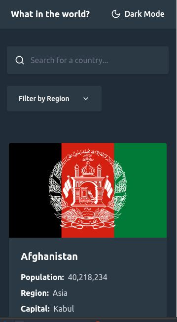
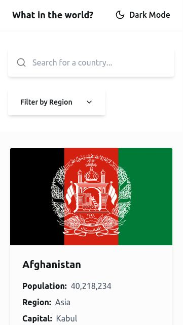
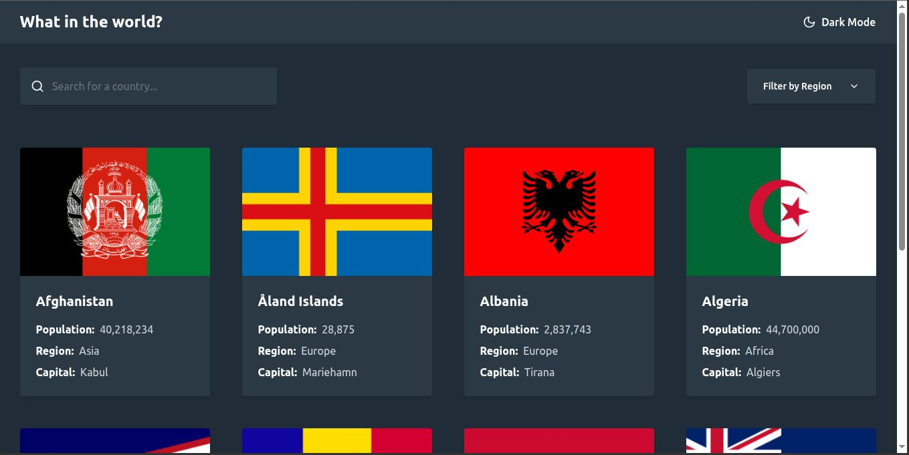
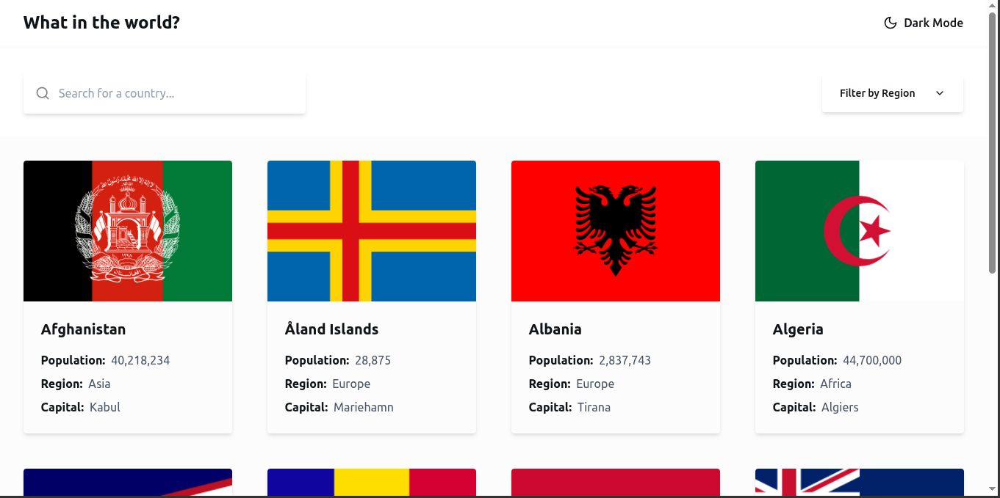

# Frontend mentor challenge - REST Countries API with color theme switcher
- This is a solution for the frontendmentor Challenge REST "Countries API with color theme switcher"
- This challenge consisted of integrating the API “data.json” that contains information and characteristics of different countries so that it works in real time and can display all kinds of information about the countries within the API.

## Technologies

- HTML 
- CSS
- JAVASCRIPT
- REACT
- TAILWINDCSS
- Lucide Icons
- VITE

## Screenshots
  

      
 Mobile - Dark

      
      
 Mobile - Light

      
  

  

      
 Desktop - Dark

      
      
 Desktop - Light

      
  

  

## Characteristics
- Filter by Continent
- Filter by Country Name
- Change between Dark Mode / Light Mode
- Country card view in 2x4 format (8 per load)
- Progressive loading of more countries (8 more per click)
- Detailed view when clicking on a country (with extended information)

## Links
- Frontendmentor (https://www.frontendmentor.io)
- My portfolio (https://gaston-gomez1997.netlify.app/)
